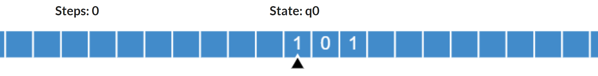
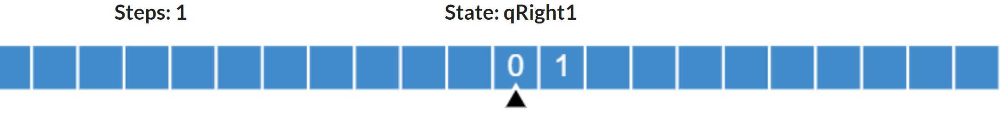
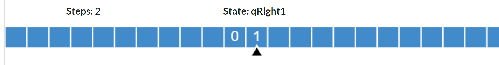
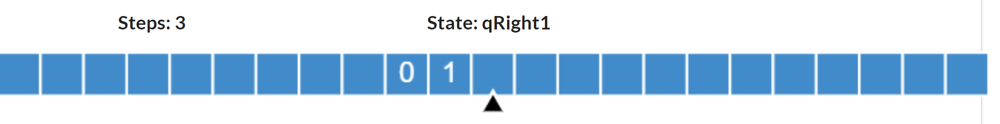
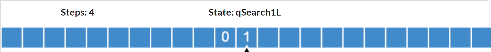

# SimpleTuringMachine
GO语言的简易图灵机实现。可以在main.go或者turing_test.go下运行。

# 图灵机科普
图灵机由图灵提出，用于一组计算任务。图灵机根据输入，在一组规则的作用下，将转换为输出。如果一门语言可以模拟出图灵机的功能，它就是图灵完备的。

# 构成
图灵机由如下部分构成：
- 纸带：由格子构成，每个格子上有一个符号，可以是字母，也可以是二进制位等。纸带最初始的时候包含的数据作为输入，程序在运算的时候持续的修改，最后的内容就是输出
- 读写头：可以左移、右移一格位置；可以读取当前格子的符号；向当前格子写入一个符号。如果说纸带看作存储的话，读写头就代表着指针，指向某一存储位置。
- 有限转换规则：记录状态转换规则，罗列了程序运行中遇到的每一种情况。相当于代码。每一个状态转换规则表示在当前状态下，根据纸带格子上的符号，将得到什么新的状态，并做哪些动作。通常用五元组表示，内容包括：
	- 当前状态
	- 输入符号：若当前符号上的内容满足该输入符号，则当如何，主要就是达到什么新的状态，如何操作纸带（写入什么符号，读写头如何移动等）
	- 写入符号：写入什么符号
	- 读写头操作：右移，左移，还是不动
	- 新的状态：应转换为什么状态

你也可以把纸带理解为磁盘，读写头理解为指针，转换规则理解为代码。

整体而言，当计算一个任务的时候，图灵机基于初始状态和纸带上的输入，通过查表，得到新的状态，并更新纸带。接下来，根据当前状态和纸带内容，继续查表，如此往复，最终程序执行结束后，得到的纸带内容就是程序的输出内容。


# 例子
这个例子由[在线图灵机模拟器](https://turingmachinesimulator.com/)提供。

我们假设现在要计算一个字符串是不是回文（Palindrome）。下面给出图灵机的规则，这一段规则描述了如何处理回文串，即先对比两侧的字符，如果一致，就继续比对内部的字串，否则报错。具体来看，每一条规则占两行，第一行表示当前状态和当前格子内容，第二行表示转换到什么状态、向当前格子写入什么内容（_表示擦除，即无数据）, 读写头执行什么操作（"<"表示左移，">"表示右移, "-"表示什么也不做）。

```
q0,0
qRight0,_,>

qRight0,0
qRight0,0,>

qRight0,1
qRight0,1,>

q0,1
qRight1,_,>

qRight1,0
qRight1,0,>

qRight1,1
qRight1,1,>

qRight0,_
qSearch0L,_,<

qSearch0L,0
q1,_,<

qRight1,_
qSearch1L,_,<

qSearch1L,1
q1,_,<

q1,0
qLeft0,_,<

qLeft0,0
qLeft0,0,<

qLeft0,1
qLeft0,1,<

q1,1
qLeft1,_,<

qLeft1,0
qLeft1,0,<

qLeft1,1
qLeft1,1,<

qLeft0,_
qSearch0R,_,>

qSearch0R,0
q0,_,>

qLeft1,_
qSearch1R,_,>

qSearch1R,1
q0,_,>

qSearch0R,1
qReject,1,-

qSearch1R,0
qReject,0,-

qSearch0L,1
qReject,1,-

qSearch1L,0
qReject,0,-

q0,_
qAccept,_,-

q1,_
qAccept,_,-

qSearch0L,_
qAccept,_,-

qSearch0R,_
qAccept,_,-

qSearch1L,_
qAccept,_,-

qSearch1R,_
qAccept,_,-

```

首先在纸带上存放输入，例如101，默认读写头指向第一个字符（用绿色背景色表示）：



然后根据状态q0、输入1来查表，发现我们要进入到状态qRight0,并把当前格子擦除，然后右移动一格：
然后，我们继续对qRight1、输入0进行查表，发现新状态还是qRight1，写入0，右移动一位：



继续查表（qRight1, 1），进入新状态qRight1，写入1，右移动一格：



继续查表（qRight1, _），进入新状态qSearch1L，写入_，左移动一格：



这里面，就相当于把最左边符号和最右边符号进行了对比。接下来往复的过程就是对内部子串进行回文对比的过程，直到得到最终状态，直到我们得到qAccept状态：



大家也可以尝试下传入非回文串，试下错误输出。

注意，这里面没有“计算”，连异或这一简单的运算都没有，一切都按照规则转换表来(异或这些操作都可以转换为具体可枚举的规则)，规则转换设计正确，则最终结果就是正确的。此外，在这个过程中，如果遇到非回文，比如100这样的，那么会有某个状态会产生出错误状态，作为最终结果。

# 参考
[wiki](https://en.wikipedia.org/wiki/Turing_machine#The_%22state%22) 
[模拟器](https://turingmachinesimulator.com/)
